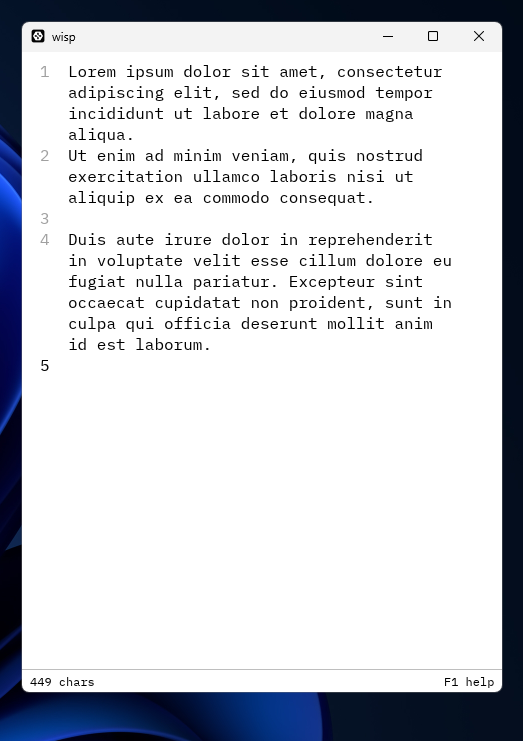

# wisp

A single-purpose scratch pad program. Wisp never saves to a file. Simply capture a thought and copy it away.

Wisp also has no settings and no flags. For configuration, edit `src/main.rs` and reinstall (see Philosophy below). Wisp is compiled; `./install.sh` rebuilds it from your edited source.

See [examples.md](examples.md) for other shapes.



Set in IBM Plex Mono, which is bundled in the binary. The bar counts characters. `F1` swaps the pad for the following key reference.

| Key | Action |
|-----|--------|
| `F1` | Help |
| `Ctrl +` / `Ctrl -` / `Ctrl 0` | Font bigger / smaller / reset |
| `Ctrl Shift C` | Copy the whole pad |
| `Ctrl Shift Backspace` | Clear the pad |
| `Ctrl T` | Light / dark |
| `Ctrl M` | Minimise |
| `Ctrl Q` | Close |

## Pinning

Wisp asks to stay on top in Windows. On Wayland, pinning belongs to your compositor. For a permanent pin, see [examples.md](examples.md).

## The Single-End Philosophy

**Software that serves a single end;** only what *you* require, and little else. This philosophy is intended for very small programs in a world of token abundance.

- Settings are bloat. Just change the code.
- Different user, different code. Ends are bespoke.
- Few lines of code keep the program pliable, cheap in tokens, and gratifying.

## Install

Linux (Wayland):

```bash
curl -fsSL https://raw.githubusercontent.com/Comninos/wisp/master/install.sh | bash
```

Windows:

```powershell
irm https://raw.githubusercontent.com/Comninos/wisp/master/install.ps1 | iex
```

From a clone, `./install.sh` or `.\install.ps1` builds from source (needs [Rust](https://rustup.rs)). Without a clone, they download the latest release.

## For Agents

- Keep the shape: one `src/main.rs`, no config, no flags, no files written.
- Prefer editing constants (`FONT`, `SIZE`, `START`, `TYPEFACE`) and `keys` over adding switches.
- Keep `HELP` in step with `keys`.
- Reinstall from the clone after edits.

## License

Code: [MIT](LICENSE). IBM Plex Mono: [SIL OFL 1.1](fonts/OFL.txt). Icon glyph from [Lucide](https://lucide.dev): [ISC](icon/LICENSE).
